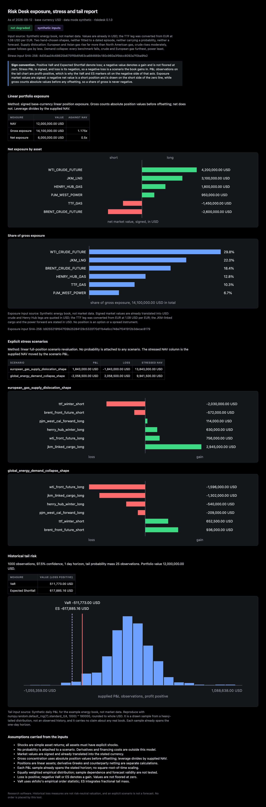
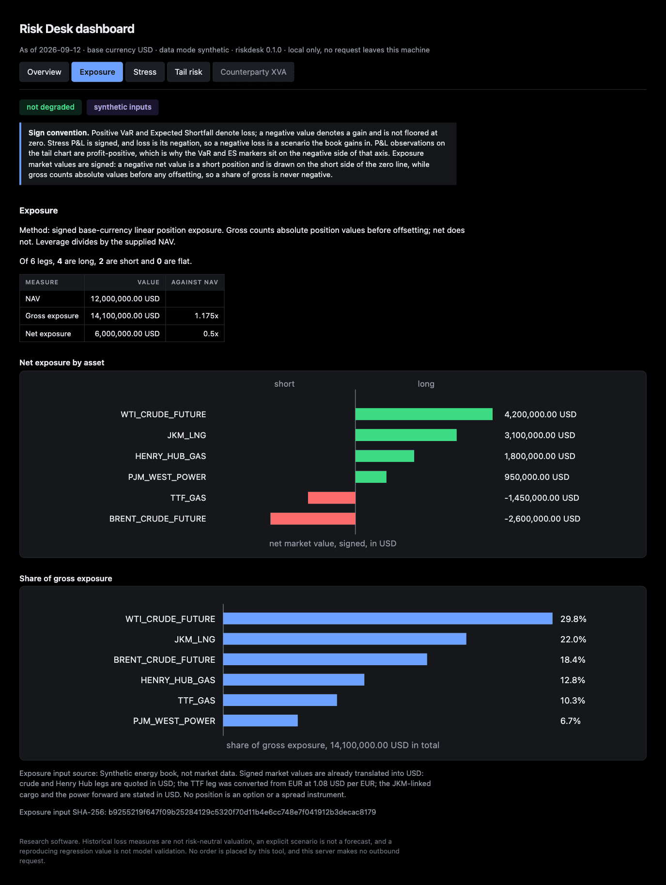

# Risk Desk

Risk Desk measures the loss side of a book and shows its working. It
calculates historical VaR and Expected Shortfall from supplied P&L,
gross and net exposure for signed linear positions, explicit stress
scenarios that carry no probability, and counterparty exposure and XVA
through a local Open Source Risk Engine project. The CLI and 4 local MCP
tools call the same runtime functions, so an agent and a person get the
same numbers with the same provenance, units, assumptions and degraded
flag attached. 5 plugin skills cover these tasks and setup.

[](docs/IMPLEMENTATION.md)
[](#development)
[](#get-started)
[](LICENSE)

## See the desk



One page, written by `riskdesk report`, from the synthetic energy book in
`examples/`. Synthetic example inputs, not market data and not a record of
any position. The page states its sign convention, prints its degraded
flag whether or not it is set, and embeds its own styling and charts, so it
opens with no network.

Both surfaces follow the reader's system setting: these captures are the
dark default, and there is a light mode built from the same tokens. Every
colour comes from one token layer, so neither mode is hard coded in a
rule, and no rule outside that layer writes a colour at all.

### The dashboard


The same numbers over a loopback socket, five views: overview, exposure,
stress, tail risk and counterparty XVA. Synthetic example inputs, not
market data. It binds a loopback address and refuses anything else, makes
no outbound request, and reads no path from the request. Every view prints
the sign convention and the degraded flag whether or not the flag is set,
and a view whose input was absent says so in words that do not imply a
zero.



The exposure view, which is where the sign convention earns its keep. The
ladder puts the 6 legs of the synthetic energy book on the side of the
zero line their sign says they are on, so a short reads as a short without
anyone reading the minus sign, and the concentration chart is ordered and
says what the shares are shares of.

## Get started

Requirements: Git, and a Python the project supports. `pyproject.toml`
declares 3.11 or later; the pinned dependency set and the ORE wheel were
tested on CPython 3.13, macOS ARM64.

```sh
git clone https://github.com/Iman/agent-driven-risk-desk-and-skills.git
cd agent-driven-risk-desk-and-skills
./install.sh
./demo.sh
```

Then, for the web view:

```sh
.venv/bin/riskdesk dashboard          # http://127.0.0.1:8899
```

`install.sh` creates `.venv`, installs the package with its development
extra, attempts the optional ORE extra and says plainly whether that
worked, then runs the tests. `demo.sh` runs every command over the 6
example input files and prints what each result means. Neither script
prints colour, neither reaches the network beyond pip, and both exit
non-zero on any failure.

### Or run it in a container

No Python needed, and the examples travel with the image:

```sh
docker build -t risk-desk .
docker run --rm --user "$(id -u):$(id -g)" \
    -v "$PWD/artifacts:/artifacts" risk-desk demo
docker run --rm risk-desk                        # what this image can do
```

`--user` is not decoration. The image runs as a fixed non-root uid on
purpose, and on Linux a bind mount keeps the ownership it has on the host,
so without it the container cannot write into your directory. Docker
Desktop on macOS hides that by remapping ownership, which is how this
reached CI green on a laptop and red on a Linux runner. Run without it and
the entrypoint refuses with exit 65 and prints the line above.

The image ships the core scope. The ORE extra is platform dependent and
this was measured, not assumed: on `python:3.13-slim` at linux/amd64 pip
resolves open-source-risk-engine 1.8.16.0, and at linux/arm64 pip reports
no distribution of any version. So the build attempts it, records what
happened, and `docker run risk-desk` prints that status; `xva` is refused
up front with the reason rather than failing inside a worker. Build with
`--build-arg WITH_XVA=require` to turn a missing extra into a failed build.

A command that writes a file into a container with no volume mounted is
refused with exit 64, because the summary it would print is identical to a
real run and the file would be gone on exit. A mount the container cannot
write is refused with exit 65 before anything runs, an artifacts path that
does not exist with exit 66, and `xva` with no ORE backend with exit 69.

The plugin is [plugins/risk-desk](plugins/risk-desk). It starts
`riskdesk-mcp` through PATH, so either activate the environment in the
client's launch environment or configure the client with the absolute path
to the installed executable. Installing the plugin does not install the
runtime. The server speaks stdio and makes no market-data or broker
requests.

## Ask your agent

### Install the plugin

The runtime is a normal Python install; the plugin only tells your agent
where to find it. Install the runtime first with `./install.sh`, then make
`riskdesk-mcp` reachable, either by activating `.venv` in the environment
that launches the agent or by pointing the client at
`.venv/bin/riskdesk-mcp` by absolute path.

| Runtime | Install the plugin | Manifest it reads |
| --- | --- | --- |
| Claude Code | `/plugin marketplace add Iman/agent-driven-risk-desk-and-skills` then `/plugin install risk-desk@risk-desk` | [.claude-plugin/plugin.json](plugins/risk-desk/.claude-plugin/plugin.json), listed in [.claude-plugin/marketplace.json](.claude-plugin/marketplace.json) |
| Codex | Configure the plugin through a Codex marketplace, or add its runtime with `codex mcp add riskdesk -- "$PWD/.venv/bin/riskdesk-mcp"`. Hosted setup is in [OpenAI connections](docs/OPENAI.md). | [.codex-plugin/plugin.json](plugins/risk-desk/.codex-plugin/plugin.json), which points at `skills/` and `.mcp.json` |
| Any MCP client | Add `.mcp.json`'s single stdio server, or run `riskdesk-mcp` yourself | [.mcp.json](plugins/risk-desk/.mcp.json) |
| Hosted | The endpoint is live at `https://riskdesk.avidquant.com/mcp` and advertises 3 risk tools plus a status tool. It serves synthetic demo data only, and it cannot run `risk_xva`. | [risk-desk-hosted](plugins/risk-desk-hosted/README.md) |

Both manifests describe the same plugin, both point at the same 5 skill
directories, and a validation test fails the build if either stops
matching what is on disk. Installing the plugin does not install the
runtime.

### Prompts

With the plugin installed, these are things a person types.

| Ask this | Skill | Tool it calls |
| --- | --- | --- |
| "Here is a year of daily P&L in GBP. What is my 99% one-day VaR and Expected Shortfall, and is the sample big enough to say?" | `risk-tail` | `risk_tail` |
| "Take `examples/energy_book.json`. What is my gross and net exposure, my leverage against NAV, and which asset is the biggest share of gross?" | `risk-portfolio` | `risk_exposure` |
| "Apply the two shapes in `examples/energy_stress.json` and tell me the loss, the stressed NAV, and the three positions that hurt most in each." | `risk-stress` | `risk_stress` |
| "Run this ORE project and give me the CVA and DVA. Tell me first whether ORE reported any error and which adjustments were actually enabled." | `risk-xva` | `risk_xva` |

Each skill states the sign convention and the degraded status before the
numbers, because a loss figure without them is unreadable.

### Read it in a browser

`riskdesk dashboard` serves the synthetic energy book by default, from
`examples/`, and takes the same `--input`, `--tail`, `--exposure` and
`--xva` flags as `riskdesk report`. It computes nothing of its own: the
views come from the functions the CLI and the MCP tools call, through the
same shaping path as the saved report page, so the two cannot disagree
about a number.

It serves one machine. There is no authentication, so it binds a loopback
address and refuses any other host rather than letting a typo in a flag put
a risk book on a network. Each failure has its own exit code and a sentence
on stderr: 64 for a host that is not loopback, 66 for a missing input, 67
for an input that fails its contract, 73 for a port already in use.

The XVA view never runs ORE. The adapter needs a trusted local project
directory, a fresh output directory and a separate process, so the view
reprints a result the adapter already wrote, or explains what is missing.

## What it computes

The input contracts are in
[plugins/risk-desk/references/contracts.md](plugins/risk-desk/references/contracts.md).
The Pydantic models in `src/riskdesk/models.py` are the executable version;
unknown fields and nonfinite numbers are rejected.

- **Tail risk** consumes monetary P&L observations that already span the
  stated horizon. It uses skfolio's empirical quantile and fractional-tail
  Expected Shortfall. Positive VaR and ES mean loss; negative values are
  preserved as gains and are not floored at zero. No square-root-of-time
  scaling is applied and no observation is dropped.
- **Exposure** requires signed linear-position market values already
  translated into one base currency. Gross counts absolute values before
  offsetting; net does not. Leverage divides by the supplied NAV. The
  report draws it as [the two charts above](#the-exposure-section-closer).
- **Stress** requires an explicit return shock for every asset in every
  scenario. It reports P&L, loss, stressed NAV and per-position
  contributions. It attaches no probability to a scenario.
- **ORE exposure and XVA** preserves upstream column names, currency,
  requested adjustment flags and unavailable values. Netting-set and trade
  rows overlap, so they are never summed, and a zero in a disabled column
  is not a result. See [docs/ORE.md](docs/ORE.md) for the pinned
  reproduction, what it does and does not establish, and the rules for
  running your own project. Version 1.8.16.0 was tested on CPython 3.13,
  macOS ARM64; install `.` without the extra for everything else.

Every core result carries provenance, a SHA-256 of its input, its currency,
its assumptions and a degraded flag. A small tail sample raises a warning.
That warning is a reporting threshold, not a confidence interval and not
forecast validation.

## What it does not claim

This is research tooling. It reads files you give it, writes files, and
places no orders; it opens no broker connection and fetches no market data.

The scope is historical VaR and Expected Shortfall, linear exposure,
explicit stress, and the ORE adapter. It does not establish regulatory
compliance, forecast skill, wrong-way-risk calibration, liquidity survival,
SIMM permissions, or coverage of every instrument ORE supports. A
historical loss measure is not risk-neutral valuation, and a regression
value that reproduces is not model validation. Options, nonlinear margin
and credit migration do not fit the linear contract; use a configured
valuation model for those, not this one.

## Development

```sh
.venv/bin/python -m pytest -q --color=no          # 268 tests, none skipped
.venv/bin/python scripts/evidence.py check        # documents match the record
.venv/bin/python -m coverage run -m pytest -q --color=no -m unit
.venv/bin/python -m coverage json -q
.venv/bin/python scripts/check_unit_coverage.py artifacts/coverage/unit.json
.venv/bin/python scripts/mutate.py                # break it, check it is noticed
.venv/bin/python -m build
```

Tests are separated by marker: `-m unit` runs in process with no subprocess
and no socket, `-m integration` runs the real scripts and the real stdio
transport, and `-m validation` checks the repository and its documents. The
coverage gate is measured from the unit suite alone, because integration
tests light up lines they assert nothing about, and it refuses a report
that is missing a production file.

`scripts/mutate.py` breaks the analytics on purpose, 33 ways, and requires
the tests to notice: sign flips, the quantile boundary, gross counted as
net, the leverage divisor, the degraded flag and every validation rule. Its
last recorded run detected 31 by the test file named for each, found no
survivors, and recorded 2 mutants as equivalent with the measurement that
justifies calling them that. There is no mutation badge here, because two
cases are not killed and a badge would round that away.

`scripts/evidence.py` is the part worth a minute. The figures that travel
between documents, the ones quoted here and in `docs/ORE.md`,
`docs/IMPLEMENTATION.md` and `CHANGELOG.md`, are recorded in
`docs/evidence.json` with where each came from, and `check` fails when a
document and the record disagree. A validation test runs that check, so
the suite goes red when the prose drifts from the repository. Figures the
recorder counted here are marked `measured`; the ORE regression values,
which came from a run against an upstream checkout that is not part of this
repository, are marked `pinned` with the date they were observed.

`scripts/screenshot_report.py` regenerates the images above from a page it
writes in the same run, either whole or clipped to one section's own
bounding box read from the live DOM. It needs Playwright, which is not a project
dependency, so the image is committed and regenerating it is deliberate.

See [CHANGELOG.md](CHANGELOG.md) for what changed and when it was
measured, [SECURITY.md](SECURITY.md) for what is in scope and how to report
privately, and [DISCLAIMER.md](DISCLAIMER.md) for the terms of use.

## Licensing

Risk Desk's own code is source-available under
[PolyForm Noncommercial 1.0.0](LICENSE). Upstream software keeps its own
licence, copyright notice and disclaimer: 79 upstream notice files from 47
distributions are retained unchanged in [notices/](notices/) and travel in
the wheel, the source archive and the plugin package. See
[THIRD-PARTY.md](THIRD-PARTY.md) for the credits, and note that market-data
rights and methodology rights are separate from software licences.
